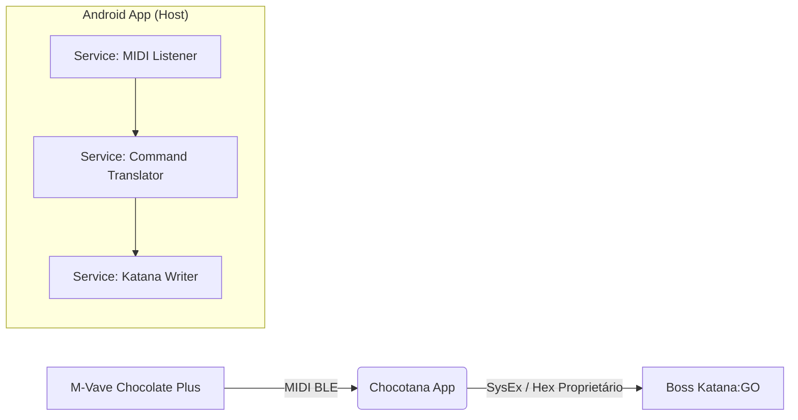

# Chocotana (Experimental)

## 1. Visão Geral do Projeto

**Chocotana** é um aplicativo Android experimental desenvolvido para atuar como uma ponte de comunicação (MIDI Bridge) entre o controlador de pé **M-Vave Chocolate Plus** e o amplificador de fone **Boss Katana:GO**.

Este projeto é uma **Prova de Conceito (PoC)** de uso pessoal, criada para superar limitações de interoperabilidade entre os dispositivos. Embora desenvolvido inicialmente para atender a um fluxo de trabalho específico, a arquitetura foi desenhada visando a possibilidade de uma futura disponibilização pública ou open-source.

**Nota:** Este é um software não-oficial e independente. Não possui vínculo com a Boss/Roland ou com a M-Vave.

## 2. O Problema

O Boss Katana:GO e o M-Vave Chocolate Plus operam via Bluetooth Low Energy (BLE). No entanto, ambos funcionam tipicamente como periféricos e utilizam protocolos distintos (MIDI vs. Proprietário). Não é possível pareá-los diretamente sem um "host" intermediário.

O **Chocotana** preenche essa lacuna, permitindo a troca de presets e bancos do amplificador utilizando o controlador de pé em um cenário de performance ao vivo.

## 3. Arquitetura da Solução

O aplicativo funciona como um **BLE Central** que gerencia duas conexões simultâneas e traduz os comandos em tempo real:

1. **Input (MIDI):** Recebe comandos MIDI padrão (Program Change ou CC) do M-Vave Chocolate Plus.
2. **Output (Proprietário):** Traduz esses comandos e envia instruções hexadecimais proprietárias para o Boss Katana:GO.

### Fluxo de Dados

## 4. Requisitos Funcionais (Escopo MVP)

O escopo atual é estritamente focado na **navegação** (Live Mode). Funcionalidades de edição profunda de timbre (EQ, Drive, etc.) estão fora do escopo desta versão experimental.

### Funcionalidades Core

* **Scan & Connect:** Capacidade de escanear e conectar-se simultaneamente ao *Chocolate Plus* e ao *Katana:GO*.
* **Keep-Alive:** Manter a conexão ativa com ambos os dispositivos.
* **Navegação de Presets:** Enviar comandos para avançar/recuar presets dentro do banco atual.
* **Navegação de Bancos:** Enviar comandos para avançar/recuar bancos de memória.
* **Feedback Visual Mínimo:** Interface utilitária indicando apenas o status da conexão (Conectado/Desconectado).

## 5. Stack Tecnológico

* **Linguagem:** Kotlin.
* **Plataforma:** Android (Min SDK 24+).
* **Arquitetura:** MVVM (Model-View-ViewModel) recomendada.
* **Conectividade:**
* Uso de API BluetoothGatt nativa ou bibliotecas wrapper (ex: RxAndroidBle/Kable).

## 6. Mapeamento de Hardware e MIDI

O M-Vave Chocolate Plus possui 4 footswitches. O **Chocotana** espera o seguinte comportamento (configurável no hardware para enviar *Program Change* ou *Control Change*):

| Footswitch | Ação no App | Comando Esperado (Input) | Ação no Katana (Output) |
| --- | --- | --- | --- |
| **A** | Previous Preset | CC #1 ou PC X | `PRESET_DOWN` |
| **B** | Next Preset | CC #2 ou PC Y | `PRESET_UP` |
| **C** | Previous Bank | CC #3 ou PC Z | `BANK_DOWN` |
| **D** | Next Bank | CC #4 ou PC W | `BANK_UP` |

## 7. Estratégia de Comunicação (Engenharia Reversa)

O Boss Katana:GO utiliza um serviço GATT proprietário. O desenvolvimento depende da identificação dos seguintes pontos através de *packet sniffing* (HCI Log):

### 7.1. Handshake Inicial

Identificar a sequência de bytes necessária para colocar o Katana:GO em "Editor Mode" logo após a conexão, permitindo a recepção de comandos externos.

### 7.2. Serviços e Características (UUIDs)

* **Service UUID:** Identificar o serviço principal de comunicação da Boss.
* **Write Characteristic:** Endpoint para envio de comandos.
* **Notify Characteristic:** Endpoint para recebimento de confirmações.

### 7.3. Estrutura do Payload

Isolamento dos comandos hexadecimais (provavelmente SysEx iniciando em `F0 41...`) correspondentes às ações de incrementar e decrementar bancos e presets.

## 8. Status do Projeto

🚧 **Em Desenvolvimento (Experimental)**
O código atual é instável e sujeito a alterações drásticas conforme o entendimento do protocolo proprietário evolui.

---
